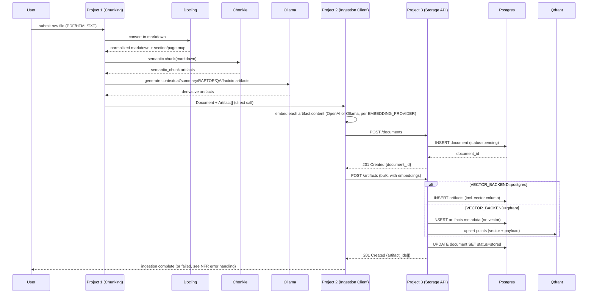
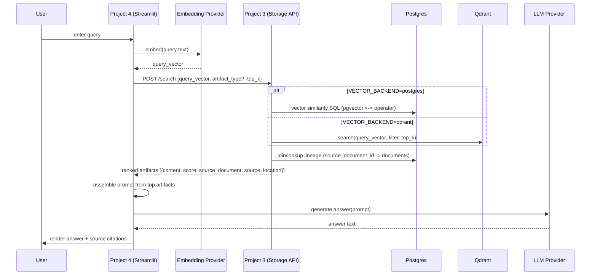
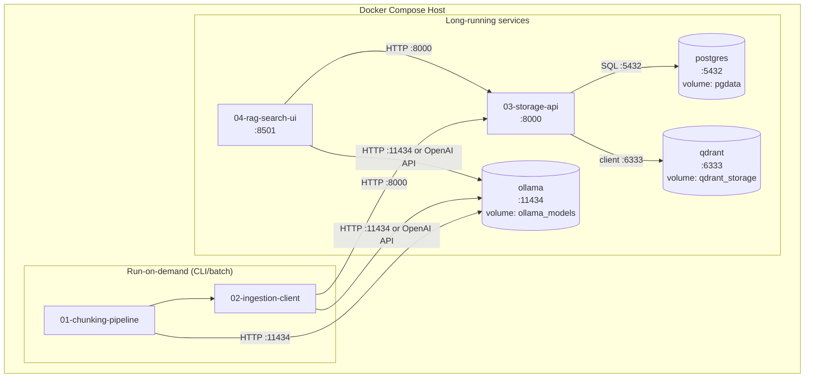

# Enterprise RAG Solution — High-Level Design (HLD)

## 1. Purpose & Relationship to SPEC.md

[SPEC.md](SPEC.md) is the source of truth for *scope*: what the 4 projects are, what they're responsible for, the unified artifact data model, and which decisions (vector backend toggle, direct-call handoff, Docker Compose deployment, deferred auth) have already been made. This document is the source of truth for *how the components interact at runtime* — concrete sequence diagrams, request/response schemas, the internal repository interface for Project 3, and non-functional requirements (error handling, logging, performance) that SPEC.md intentionally left out. Read SPEC.md first; this document assumes its terminology (`Artifact`, `artifact_type`, `Document`, the 4 project numbers) without re-explaining it.

## 2. Component Responsibility Table

| Component | Responsibility | Inputs | Outputs | Protocol |
|---|---|---|---|---|
| Project 1 — Chunking Pipeline | Convert raw docs to markdown, generate all derivative artifact types | Raw file (PDF/HTML/TXT) | `Document` + `Artifact[]` (in-memory) | Direct Python call to Project 2 |
| Project 2 — Ingestion Client | Embed artifact content, persist via Project 3 | `Document` + `Artifact[]` from Project 1 | Persisted records, document status | HTTP (calls Project 3); provider SDK/API call (OpenAI or Ollama) for embeddings |
| Project 3 — Storage API | CRUD + vector search, sole owner of storage access | HTTP requests from Projects 2 & 4 | JSON responses | HTTP (FastAPI); SQL to Postgres, gRPC/HTTP client to Qdrant |
| Project 4 — RAG Search UI | Query embedding, retrieval, answer generation, citation display | User query (Streamlit) | Rendered answer + citations | HTTP (calls Project 3); provider SDK/API call for LLM |
| PostgreSQL | Persist `documents` + `artifacts` metadata/lineage always; vectors too when active backend | SQL from Project 3 | Rows | SQL (psycopg/asyncpg) |
| Qdrant | Persist vectors + payload when active backend | Upserts from Project 3 | Points | Qdrant client (gRPC/HTTP) |
| Ollama | Serve local models for derivative generation, embeddings, and/or LLM generation | Prompts / text | Generated text or embedding vectors | HTTP (Ollama REST API) |

## 3. Sequence Diagram: Document Ingestion Flow



## 4. Sequence Diagram: Search Flow



## 5. API Contract — Project 3

All endpoints return the standard error shape on failure:

```json
{
  "error": {
    "code": "VALIDATION_ERROR | NOT_FOUND | BACKEND_UNAVAILABLE | INTERNAL_ERROR",
    "message": "human-readable description",
    "detail": {}
  }
}
```

HTTP status conventions: `400` validation error, `404` not found, `502` active backend (Postgres/Qdrant) unreachable, `500` unhandled internal error.

### `POST /documents`

Request:
```json
{
  "original_filename": "policy-handbook.pdf",
  "original_format": "pdf",
  "normalized_markdown_ref": "s3://.../policy-handbook.md"
}
```
Response `201`:
```json
{
  "document_id": "8f14e...-uuid",
  "status": "pending",
  "ingested_at": "2026-08-29T10:15:00Z"
}
```

### `POST /artifacts` (bulk)

Request:
```json
{
  "document_id": "8f14e...-uuid",
  "artifacts": [
    {
      "artifact_type": "semantic_chunk",
      "content": "All employees must complete...",
      "embedding": [0.0123, -0.0456, ...],
      "source_location": {"page": 3, "section": "Onboarding"},
      "parent_artifact_id": null,
      "model_metadata": {"embedding_model": "ollama/nomic-embed-text"}
    },
    {
      "artifact_type": "qa_pair",
      "content": "Q: How long is the onboarding period?\nA: 90 days.",
      "embedding": [0.0234, -0.0987, ...],
      "source_location": {"page": 3, "section": "Onboarding"},
      "parent_artifact_id": "<semantic_chunk artifact_id above>",
      "model_metadata": {"generation_model": "ollama/llama3.1:8b"}
    }
  ]
}
```
Response `201`:
```json
{
  "document_id": "8f14e...-uuid",
  "artifact_ids": ["a1b2...", "c3d4..."],
  "status": "stored"
}
```

### `POST /search`

Request:
```json
{
  "query_vector": [0.0111, -0.0222, ...],
  "artifact_type": "semantic_chunk",
  "top_k": 5
}
```
`artifact_type` is optional (omit to search across all types). Response `200`:
```json
{
  "results": [
    {
      "artifact_id": "a1b2...",
      "artifact_type": "semantic_chunk",
      "content": "All employees must complete...",
      "score": 0.912,
      "source_document_id": "8f14e...-uuid",
      "original_filename": "policy-handbook.pdf",
      "source_location": {"page": 3, "section": "Onboarding"}
    }
  ]
}
```

### `GET /documents/{document_id}/artifacts`

Response `200`:
```json
{
  "document_id": "8f14e...-uuid",
  "original_filename": "policy-handbook.pdf",
  "artifacts": [
    {"artifact_id": "a1b2...", "artifact_type": "semantic_chunk", "parent_artifact_id": null},
    {"artifact_id": "c3d4...", "artifact_type": "qa_pair", "parent_artifact_id": "a1b2..."}
  ]
}
```

## 6. Repository Interface (Project 3 internal design)

A single interface both backends implement, so routers never know which is active:

```python
class Repository(Protocol):
    def create_document(self, doc: DocumentIn) -> DocumentOut: ...
    def get_document(self, document_id: UUID) -> DocumentOut: ...
    def create_artifacts(self, document_id: UUID, artifacts: list[ArtifactIn]) -> list[UUID]: ...
    def search(self, query_vector: list[float], artifact_type: str | None, top_k: int) -> list[SearchResult]: ...
    def get_lineage(self, document_id: UUID) -> list[ArtifactSummary]: ...
    def delete_document(self, document_id: UUID) -> None: ...
```

- `PostgresRepository`: all methods hit Postgres only; `search` uses pgvector's distance operator (`<->` or `<=>`) directly in SQL.
- `QdrantRepository`: `create_document`/`get_document`/`get_lineage`/`delete_document` still hit Postgres (metadata always lives there); `create_artifacts` writes metadata rows to Postgres **and** upserts vector+payload to Qdrant; `search` queries Qdrant, then joins the returned `artifact_id`s back against Postgres for lineage fields.
- **Dual-write failure handling** (Qdrant mode): write Postgres metadata first inside a transaction, then upsert to Qdrant. If the Qdrant upsert fails, roll back by deleting the just-inserted Postgres rows and return `502 BACKEND_UNAVAILABLE` to the caller — the caller (Project 2) treats this as a document-level failure per SPEC.md §6 (mark `status=failed`, safe to retry since `document_id` generation is idempotent-safe on re-run).

## 7. Configuration Contract

| Env var | Consumed by | Values | Default | Purpose |
|---|---|---|---|---|
| `VECTOR_BACKEND` | Project 3 | `postgres` \| `qdrant` | `postgres` | Selects active `Repository` implementation |
| `EMBEDDING_PROVIDER` | Project 2, Project 4 | `openai` \| `ollama` | `ollama` | Selects embedding provider |
| `EMBEDDING_MODEL` | Project 2, Project 4 | e.g. `text-embedding-3-small`, `nomic-embed-text` | provider-dependent | Must match at ingestion and query time |
| `LLM_PROVIDER` | Project 4 | `openai` \| `ollama` | `ollama` | Selects generation LLM |
| `LLM_MODEL` | Project 4 | e.g. `gpt-4o-mini`, `llama3.1:8b` | provider-dependent | Answer-generation model |
| `GENERATION_MODEL` (per artifact type) | Project 1 | e.g. `llama3.1:8b`, `qwen2.5:7b`, `gemma2:9b` | `llama3.1:8b` | Which local model drives each derivative-generation step; can be set per artifact type (`GENERATION_MODEL_SUMMARY`, `GENERATION_MODEL_QA`, etc.) |
| `POSTGRES_DSN` | Project 3 | connection string | — | Postgres connection |
| `QDRANT_URL` | Project 3 | URL | — | Qdrant connection (only required if `VECTOR_BACKEND=qdrant`) |
| `OLLAMA_BASE_URL` | Project 1, 2, 4 | URL | `http://ollama:11434` | Ollama server endpoint |
| `OPENAI_API_KEY` | Project 2, 4 | secret | — | Only required if provider=openai |

## 8. Non-Functional Requirements

### Error handling & retries

- **Project 1 → Project 2 (direct call)**: exceptions propagate synchronously; Project 1 catches and logs, marks the document as failed at the source rather than calling Project 2 with partial artifacts.
- **Project 2 → embedding provider**: transient failures (timeouts, rate limits) retried with exponential backoff (e.g. 3 attempts). A non-retryable failure (auth error, malformed input) aborts the whole document immediately.
- **Project 2 → Project 3**: on any non-2xx response from Project 3, Project 2 does not retry the write blindly (to avoid duplicate artifacts) — it calls `PATCH` (or a dedicated failure endpoint) to mark the document `status=failed` and surfaces the error; the document can be safely re-ingested from Project 1 later.
- **Project 3 → active backend**: connection/query failures return `502 BACKEND_UNAVAILABLE`; Project 3 does not silently fall back to the other backend (backend choice is a fixed deployment config, not a runtime failover).
- **Project 4 → Project 3 / LLM**: search or generation failures are caught and shown to the user as an inline error message in the Streamlit UI; a search failure does not attempt an LLM call.

### Logging & observability

- Every log line across all 4 projects includes `document_id` (and `artifact_id` where applicable) so a single ingestion or query can be traced across process boundaries by grepping logs.
- Structured (JSON) logging to stdout in every container; Docker Compose's default log driver collects these — no dedicated log aggregation stack in this phase (deferred, consistent with SPEC.md §11 scope boundaries).
- Minimum logged events: Project 1 — per-artifact-type generation start/end + counts; Project 2 — embedding batch size/duration, Project 3 API call outcome; Project 3 — every request's method/path/status/latency, backend selected; Project 4 — query text (hash or truncate if sensitive), retrieved artifact count, LLM latency.

### Performance & scalability expectations

- This is a single-node, on-prem Docker Compose deployment; Project 1's direct synchronous call into Project 2 means one document is processed end-to-end before the next begins — there is no parallel document processing in this phase.
- Expected working scale for v1: batches of tens to low hundreds of documents processed sequentially per run; long documents (RAPTOR-eligible) will dominate processing time since they require the most Ollama calls.
- Ollama inference throughput (not network or DB I/O) is expected to be the bottleneck for Project 1, since every derivative artifact type beyond semantic chunking requires an LLM call per chunk.
- This architecture will need the deferred async-queue redesign (SPEC.md §11) once ingestion volume requires parallel document processing or horizontal scaling of Project 1/2 workers — not addressed further here since it's explicitly out of scope for this phase.

## 9. Deployment Diagram



## 11. Testing Strategy

### Test types used across all projects

- **Unit tests**: pure logic, no external services — LLM/embedding calls and HTTP clients are mocked.
- **Integration tests**: a project talking to a real (but local/ephemeral) dependency — e.g. Project 3 against a real Postgres/Qdrant instance spun up via `testcontainers-python`; Project 1 against a real Docling/Chonkie run on small fixture files.
- **Contract tests**: validate that Project 3's actual request/response JSON matches the schemas frozen in §5, so drift between this document and the implementation is caught automatically rather than discovered at integration time.
- **End-to-end (optional, later)**: one document pushed through the full docker-compose stack (Project 1 → 2 → 3 → 4 search). Gated separately from the fast unit/integration suites since it requires the whole stack up.

### Common conventions

Every project folder gets its own `tests/` directory and its own dependency group, so tests run independently per project — matching the "developed/deployed in parts" goal from SPEC.md §1. `pytest` is the framework for all 4 projects, plus `pytest-asyncio` for Project 3's async FastAPI routes, `httpx` for API-client testing, and `unittest.mock`/`respx` for stubbing OpenAI/Ollama HTTP calls.

### Per-project test plan

| Project | What's tested | How |
|---|---|---|
| 1 — Chunking Pipeline | Each chunker (`semantic.py`, `contextual.py`, `summarize.py`, `raptor.py`, `qa_pairs.py`, `factoids.py`); Docling conversion; long-document section-split threshold | Unit tests with Ollama calls mocked to fixed responses; fixture-based tests feeding small sample PDF/HTML/TXT files through Docling and asserting normalized markdown + section/page metadata |
| 2 — Ingestion Client | Embedding-provider toggle (OpenAI vs Ollama); success path and partial-failure/retry path (§8) | Unit tests mocking both provider code paths; integration test against a running Project 3 test instance (or an HTTP mock honoring the §5 contracts) |
| 3 — Storage API | Every route in §5; both `VECTOR_BACKEND` modes; dual-write failure/rollback behavior (§6); response-shape drift | FastAPI endpoint tests via `TestClient`/`httpx.AsyncClient`; repository-level integration tests against ephemeral Postgres and Qdrant containers (`testcontainers-python`); contract tests asserting responses match §5 exactly |
| 4 — RAG Search UI | LLM-provider toggle; query → search-call → prompt-assembly logic; app load and round-trip rendering | Unit tests with Project 3 and the LLM mocked; a Streamlit smoke test using Streamlit's `AppTest` utility |
| shared-schemas | `Artifact`, `Document`, and config pydantic models reject invalid data and (de)serialize correctly | Unit tests — every other project depends on this contract holding |

### CI outline

One CI job per project, matching the folder-per-project layout, running that project's own `tests/` in isolation. A separate, optional end-to-end job spins up the full docker-compose stack for the e2e flow. No specific CI provider is mandated here — GitHub Actions is a reasonable default given the repo is on GitHub, but that choice is left for later.

## 12. Traceability back to SPEC.md

| SPEC.md section | Elaborated in this document |
|---|---|
| §2 System Architecture | §3, §4 (sequence diagrams), §9 (deployment diagram) |
| §4 Data Model | §5 (concrete JSON shapes), §6 (how it's persisted per backend) |
| §5–8 Per-project design | §2 (responsibility table), §3–4 (their runtime interactions), §5 (Project 3's actual contract) |
| §9 Cross-Cutting Concerns | §7 (concrete config table), §8 (NFRs, newly added here) |
| §11 Open Questions | §8 performance section explicitly notes where the async-queue deferral becomes necessary |
| *(no SPEC.md counterpart)* | §11 Testing Strategy — DESIGN.md-only addition |
