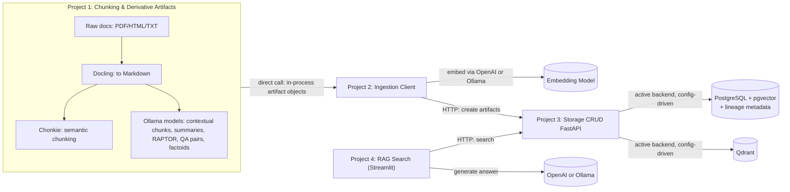

# Enterprise RAG Solution — High-Level Specification

## 1. Overview & Goals

Build an enterprise-grade Retrieval-Augmented Generation (RAG) platform to search across internal documents in mixed formats (PDF, HTML, TXT/DOC), including long documents spanning many pages. The system is split into **4 independently developable and deployable projects**, connected by a shared data contract, so each can be built, tested, and shipped in isolation.

Goals:
- Normalize heterogeneous document formats into a single clean representation before chunking.
- Produce multiple *kinds* of derivative retrieval artifacts per document (not just flat chunks), to support different retrieval strategies.
- Keep full lineage from every stored vector record back to its originating file (and location within it).
- Keep vector backend and LLM/embedding provider swappable via configuration, not code changes.
- Run entirely on-prem via Docker Compose, with local LLMs (Ollama) available alongside OpenAI as a configurable alternative.

Out of scope for this phase: authentication/RBAC/multi-tenancy, async queue-based scaling, document versioning/reprocessing, retrieval quality evaluation. These are listed in [§11](#11-open-questions--future-enhancements) as deferred.

## 2. System Architecture



- **Project 1 → Project 2**: direct synchronous call (in-process function call or local library import), not a queue. Project 1 produces artifact objects; Project 2 embeds and persists them immediately.
- **Project 3** is the only component that talks to storage. Projects 1/2/4 never touch Postgres or Qdrant directly — everything goes through Project 3's API. This keeps the storage backend swap (Postgres/pgvector vs Qdrant) invisible to the rest of the system.
- PostgreSQL always stores `documents` and `artifacts` metadata/lineage tables regardless of which backend is "active" for vector similarity search.

## 3. Repo / Folder Layout

```
AIERAG-Rundown/
├── SPEC.md
├── docker-compose.yml
├── shared-schemas/              # data contract shared by all 4 projects
│   ├── artifact.py               # ArtifactType enum, Artifact/Document dataclasses or pydantic models
│   └── config.py                 # shared provider-toggle config models
├── 01-chunking-pipeline/         # Project 1
│   ├── docling_convert.py
│   ├── chunkers/
│   │   ├── semantic.py            # chonkie-based
│   │   ├── contextual.py          # ollama-based
│   │   ├── summarize.py           # ollama-based, abstractive
│   │   ├── raptor.py              # ollama-based, hierarchical
│   │   ├── qa_pairs.py            # ollama-based
│   │   └── factoids.py            # ollama-based
│   └── pipeline.py                # orchestrates docling -> chunkers -> Project 2 client call
├── 02-ingestion-client/           # Project 2
│   ├── embedding_provider.py      # OpenAI / Ollama toggle
│   └── ingest.py                  # calls Project 3 API to persist artifacts
├── 03-storage-api/                # Project 3
│   ├── main.py                    # FastAPI app
│   ├── repositories/
│   │   ├── base.py                 # common interface
│   │   ├── postgres_repo.py        # raw psycopg/asyncpg, no ORM
│   │   └── qdrant_repo.py
│   ├── migrations/                 # raw SQL migration files
│   └── routers/
│       ├── documents.py
│       ├── artifacts.py
│       └── search.py
└── 04-rag-search-ui/              # Project 4
    ├── app.py                      # Streamlit app
    └── llm_provider.py             # OpenAI / Ollama toggle
```

Each project folder is self-contained (own `pyproject.toml`/`requirements.txt`, own Dockerfile) and depends only on `shared-schemas/` and, for 1/2/4, the HTTP contract exposed by Project 3.

## 4. Data Model

### Unified artifact schema (shared contract)

Every derivative artifact — regardless of type — is stored in **one** schema/table/collection, distinguished by `artifact_type`:

| Field | Type | Notes |
|---|---|---|
| `artifact_id` | UUID | primary key |
| `artifact_type` | enum | `semantic_chunk`, `contextual_chunk`, `summary`, `raptor_node`, `qa_pair`, `factoid` |
| `source_document_id` | UUID | FK to `documents` |
| `source_location` | JSON | page number / section heading / char offset range within the normalized markdown |
| `content` | text | the artifact's text (chunk text, summary text, QA pair as Q+A, factoid statement) |
| `embedding` | vector | dimension depends on active embedding provider/model |
| `parent_artifact_id` | UUID, nullable | links QA pairs/factoids to the chunk they were derived from; links RAPTOR nodes to their child nodes/chunks |
| `model_metadata` | JSON | which model + version produced this artifact (e.g. `ollama/llama3.1:8b`) |
| `created_at` | timestamptz | |

### `documents` table (PostgreSQL, always present)

| Field | Type | Notes |
|---|---|---|
| `document_id` | UUID | primary key |
| `original_filename` | text | |
| `original_format` | enum | `pdf`, `html`, `txt` |
| `normalized_markdown_ref` | text | path/URI to the Docling-normalized markdown |
| `ingested_at` | timestamptz | |
| `status` | enum | `pending`, `chunked`, `stored`, `failed` |

### Backend mirroring

- **When Postgres/pgvector is active**: `artifacts` table lives in Postgres with a `vector` column (pgvector extension); lineage and vector search share one database.
- **When Qdrant is active**: `documents` and artifact *metadata* (all fields except the raw vector) still live in Postgres for lineage/tracking; the same fields plus the embedding are duplicated into a Qdrant collection's point payload, keyed by the same `artifact_id`. Project 3's repository layer is responsible for keeping both in sync on writes.

## 5. Project 1 — Chunking & Derivative Artifact Generation

**Input**: raw files (PDF, HTML, TXT/DOC).
**Output**: a list of `Artifact` objects (per shared schema) handed directly to Project 2.

Steps:
1. **Docling**: convert raw PDF/DOC/HTML into normalized Markdown, preserving page/section boundaries as metadata so `source_location` can be populated downstream.
2. **Chonkie**: run semantic chunking over the normalized Markdown to produce `semantic_chunk` artifacts.
3. **Ollama-driven derivative generation**, using on-prem models (llama/gemma/qwen — model choice configurable per artifact type since some tasks may warrant a larger/smaller model):
   - `contextual_chunk`: chunk text augmented with surrounding-context summary (e.g. Anthropic-style contextual retrieval prompt).
   - `summary`: abstractive summary per document or per major section.
   - `raptor_node`: hierarchical clustering + recursive summarization tree (RAPTOR) — critical for long, multi-page documents where flat chunking loses cross-section context.
   - `qa_pair`: synthetic question/answer pairs generated from each chunk, linked via `parent_artifact_id`.
   - `factoid`: atomic factual statements extracted from each chunk, linked via `parent_artifact_id`.
4. **Long-document handling**: documents beyond a configurable page/token threshold are section-split *before* semantic chunking (using Docling's section boundaries), and always go through RAPTOR so a hierarchical summary tree exists for coarse-grained retrieval alongside fine-grained chunks.
5. **Handoff**: since Project 1 calls Project 2 directly and synchronously, no intermediate file format is required — Project 1 imports Project 2's client function and passes the in-memory list of `Artifact` objects plus the `Document` record.

## 6. Project 2 — Ingestion Client

**Role**: thin layer between Project 1's output and Project 3's storage API.

Responsibilities:
- Accept `Document` + `Artifact[]` from Project 1.
- Generate embeddings for each artifact's `content` via the configured provider (OpenAI `text-embedding-3-*` or an Ollama embedding model, e.g. `nomic-embed-text`) — provider selected via shared config, same toggle pattern as Project 4's LLM choice.
- Call Project 3's FastAPI endpoints: create the `Document` record first, then bulk-create `Artifact` records with embeddings attached.
- **Partial-failure semantics**: process one document as a unit — if any artifact in the batch fails to embed or store, mark the document `status = failed` in Postgres (via Project 3) rather than leaving it partially stored; a failed document can be safely re-run from Project 1 since it's idempotent per `document_id`.

## 7. Project 3 — Storage CRUD FastAPI (no SQLAlchemy)

**Role**: the only component with direct database/vector-store access. Exposes CRUD + search over HTTP.

- **No ORM**: use raw `psycopg` (or `asyncpg`) with hand-written SQL for Postgres; `qdrant-client` directly for Qdrant. Schema/migrations are plain `.sql` files run in order (a lightweight runner script, no Alembic).
- **Config-driven backend selection**: an env var (e.g. `VECTOR_BACKEND=postgres|qdrant`) selects which repository implementation is wired into the app at startup, behind a common `Repository` interface (`create_document`, `create_artifacts`, `search(query_vector, artifact_type=None, top_k)`, `get_lineage(document_id)`).
- **Endpoints**:
  - `POST/GET/PUT/DELETE /documents` and `/documents/{id}`
  - `POST/GET/PUT/DELETE /artifacts` and `/artifacts/{id}` (bulk create supported)
  - `POST /search` — vector similarity search, optional `artifact_type` filter, returns artifacts with lineage (source document + location)
  - `GET /documents/{id}/artifacts` — full lineage lookup, source document → all derived artifacts of every type

## 8. Project 4 — RAG Search (Streamlit)

- Streamlit UI: query box, results list, generated answer with citations.
- Config toggle for the generation LLM: OpenAI or Ollama (independent toggle from the embedding provider, though typically kept consistent).
- Flow: embed the user's query (same embedding provider Project 2 used at ingestion time — must match dimension/model), call Project 3's `/search`, assemble top results into a prompt, call the configured LLM, display the answer plus source citations built from each result's lineage (`original_filename` + `source_location`).

## 9. Cross-Cutting Concerns

- **Configuration**: each project reads its own `.env`; provider toggles (`VECTOR_BACKEND`, `EMBEDDING_PROVIDER`, `LLM_PROVIDER`) are defined once in `shared-schemas/config.py` as pydantic settings models, imported by whichever project needs them, so the same env var names and validation apply everywhere.
- **Docker Compose topology**: long-running services are `postgres` (with pgvector extension), `qdrant`, `ollama`, `03-storage-api`, `04-rag-search-ui`. Projects 1 and 2 run as CLI/batch jobs (invoked manually or via a simple cron/one-off container run) rather than long-running services, matching their direct-call, on-demand nature.
- **Traceability**: any vector record can be traced back to its origin via `artifact.source_document_id → documents.original_filename` plus `artifact.source_location` (page/section/offset), and derived artifacts (QA pairs, factoids, RAPTOR nodes) chain back to their originating chunk via `parent_artifact_id`.

## 10. Suggested Build Order

1. **Project 3** first — define the schema, migrations, and API contract, since Projects 1, 2, and 4 all depend on it. Stub both repository backends behind the common interface early.
2. **Project 1** — chunking pipeline, since it's the most complex piece (Docling + Chonkie + multiple Ollama-driven generators) and can be developed/tested against Project 3's already-stable contract.
3. **Project 2** — thin ingestion client, straightforward once 1 and 3 exist.
4. **Project 4** — search UI, last, since it only needs Project 3's `/search` endpoint and a working ingested corpus to query against.

## 11. Open Questions / Future Enhancements

Deliberately deferred from this phase:
- Authentication, RBAC, and multi-tenancy.
- Moving Project 1 → Project 2 handoff to an async queue for horizontal scaling.
- Document re-processing/versioning (what happens when a source file changes).
- Retrieval quality evaluation (e.g. golden Q&A sets, relevance metrics) and A/B comparison across artifact types.
- Kubernetes/cloud-managed deployment (current scope is Docker Compose, on-prem/local only).
